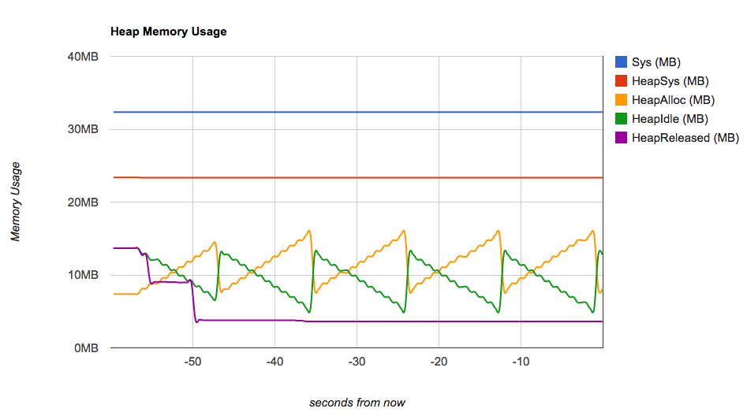

Web-Based Memory Profiler for Go Services 
=========================================

This package helps you track your service's memory usage and report custom properties.

Enabling Memory Profiling
-------------------------

To enable memory profiling, modify your main method like this:

	import (
		"net/http"
		"github.com/wblakecaldwell/profiler"
	)
	func main() {
		// add handlers to help us track memory usage - they don't track memory until they're told to
		profiler.AddMemoryProfilingHandlers()

		// Uncomment if you want to start profiling automatically
		// profiler.StartProfiling()

		// listen on port 6060 (pick a port)
		http.ListenAndServe(":6060", nil)
	}

Using Memory Profiling
----------------------

Enabling Memory Profiling exposes the following endpoints:

- http://localhost:6060/profiler/stop :    Stop recording memory statistics
- http://localhost:6060/profiler/start :   Start recording memory statistics
- http://localhost:6060/profiler/info.html :   Main page you should visit
- http://localhost:6060/profiler/info :   JSON data that feeds profiler/info.html

Working With the Template Files
-------------------------------

We bundle the template files in the Go binary with the 'go-bindata' tool. Everything in
github.com/wblakecaldwell/profiler/profiler-web is bundled up into github.com/wblakecaldwell/profiler/profiler-web.go
with the command, assuming your repository is in $GOPATH/src.

Production Code Generation (Check this in):

	go get github.com/jteeuwen/go-bindata/...
	go install github.com/jteeuwen/go-bindata/go-bindata

	go-bindata -prefix "$GOPATH/src/github.com/wblakecaldwell/profiler/profiler-web/" -pkg "profiler" -nocompress -o "$GOPATH/src/github.com/wblakecaldwell/profiler/profiler-web.go" "$GOPATH/src/github.com/wblakecaldwell/profiler/profiler-web"

If you'd like to make changes to the templates, then use 'go-bindata' in debug mode. Instead of compiling
the contents of the template files into profiler-web.go, it generates code to read the content of the template
files as they exist at that moment. This way, you can start your service, view the page, make changes, then
refresh the browser to see them:

Development Code Generation:

	go-bindata -debug -prefix "$GOPATH/src/github.com/wblakecaldwell/profiler/profiler-web/" -pkg "profiler" -nocompress -o "$GOPATH/src/github.com/wblakecaldwell/profiler/profiler-web.go" "$GOPATH/src/github.com/wblakecaldwell/profiler/profiler-web"

When you've wrapped up development, make sure to rebuild profiler-web.go to contain the contents of the file with the first non-debug command.
